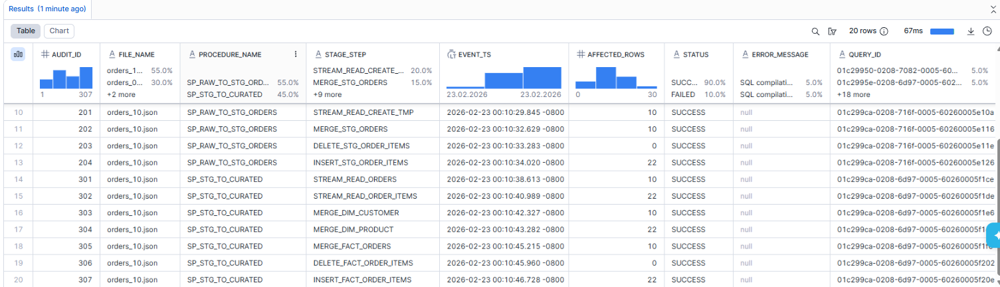

# Snowflake Incremental Data Pipeline

## Overview

Self data engineering learning Project on Snowflake-native, event driven, incremental data pipeline
built using Streams, Tasks, Snowpipe, SQL procedures and observability.

It simulates an e-commerce data engineeringworkload and implements medallion architecture, snowflake access control 
and warehouses separation across ingestion, transformation, and auditing coupled with observability. 

------------------------------------------------------------------------

## Architecture


The warehouse is divided into four schemas:

-   **RAW** -- json files are ingested to raw json table from Azure blob via snowflake pipe triggered by Azure notification on file additions  
-   **STAGED** -- stream (change data capture) on raw json table triggers task transforming raw table into order and order items tables 
-   **CURATED** -- streams on order and order items tables triggers task transforming staged tables into star schema tables (dim product, clients and facts order and order items)
-   **ORCHESTRATION** -- schema with task definition and pipeline audit table ensuring obervability 
  
### Compute & Access Separation

Separate warehouses and roles are used to isolate responsibilities:

**Warehouses** 
- `INGEST_WH` -- dedicated to Snowpipe and RAW loading\
- `TRANSFORM_WH` -- used for staged and curated transformations
- `ANALYST_WH` -- used for querying curated layer


**Roles** 
- `INGEST_ROLE` -- privileges limited to RAW schema and
ingestion objects
- `TRANSFORM_ROLE` -- read from RAW, write to STAGED/CURATED
- `ANALYST_ROLE` -- read-only access to CURATED schema

Privileges follow the principle of least privilege.

------------------------------------------------------------------------

## Data Flow

1.  JSON files land in Azure Blob Storage.
2.  Snowpipe loads data into `RAW.orders_raw`.
3.  A task processes a stream on the raw table and builds:
    -   `stg_orders`
    -   `stg_order_items`
4.  A second task consumes streams on staged tables and builds:
    -   `fact_orders`
    -   `fact_order_items`
    -   `dim_customer`
    -   `dim_product`
5.  Each task writes execution metadata to `pipeline_audit`.

Processing is fully incremental via stream consumption.

------------------------------------------------------------------------

## Key Concepts Demonstrated

-   Snowflake-native ingestion (Snowpipe)
-   Incremental processing with Streams
-   Task-based orchestration
-   Star schema modeling
-   Warehouse isolation for cost control
-   Role-based access control (RBAC)
-   Deterministic audit logging
  



------------------------------------------------------------------------

## How to Replicate

### 1. Environment Setup

-   Create a Snowflake trial account\
-   Create an Azure free account
-   Configure an Azure subscription

### 2. Clone Repository

``` bash
git clone <https://github.com/dominik-mikulski/Ecommerce_Data_Pipeline_Snowflake_Azure>
cd Ecommerce_Data_Pipeline_Snowflake_Azure
```

### 3. Deploy Snowflake Objects

Import SQL scripts into Snowflake (Workspace -> Add New -> Upload Files )

Run SQL scripts 0 to 10 in order provided, this will create and activate data pipeline.
06_Integration require steps in MS Azure read and follow commentary in SQL script. 

Scripts can be executed via Snowflake Worksheets or SnowSQL.

### 4. Drop Sample Data and Observe pipeline

Drop sample data (do 1 per some time) Azure blob, this will trigger the pipeline, check status by running select * from ECOMMERCE_DB.ORCHESTRATION.PIPELINE_AUDIT.

### 5. Diagnostic & Reset

Use 11 Diagnostic to manually check the status and history of individual elements making up the pipeline.
Use 12 Reset if you need to remova data from tables and restart tasks

## Scope

This is a focused learning implementation designed to demonstrate
architecture and governance patterns rather than production hardening
(no CI/CD or external orchestration).


## Scope

This is a focused learning implementation designed to demonstrate
architecture and governance patterns rather than production hardening
(no CI/CD or external orchestration).

**Dominik Mikulski**  
Expanding hands-on data engineering capabilities alongside 12 years of analytics leadership
[LinkedIn](https://www.linkedin.com/in/dominikmikulski/) | [dominik.mikulski@gmail.com](mailto:dominik.mikulski@gmail.com)
